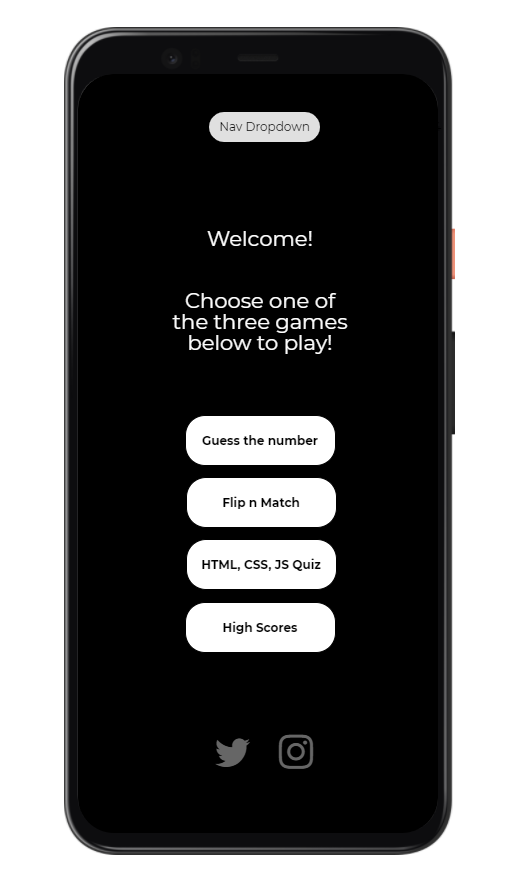

-https://github.com/Shadyxstep/CE-MS2/blob/master/assets/img/landingmockup.PNG
# <a href="https://shadyxstep.github.io/CE-MS2/index.html">Brain Games</a>

This site is 

My second development project as a Full Stack software developer student of the Code Institute (https://codeinstitute.net/), 
with a goal of demonstrating my ability to design and develop a responsive website that focuses on developing 3 simple games.

## UX

 The purpose of the site is to provide users with an online experience that focuses on testing users cognitive skills by putting them through a series of 3 simple games constructed using HTML5, CSS & Javascript. The site was built with minimalism in mind and features kept to a minimum in order to avoid distraction and unnecessary clutter. The user can focus solely on the functionality & problem solving prompts that the three games offer.

## Wireframes

1. Landing page link: https://wireframe.cc/0T2e8s

### Existing Features

  * __Home page__ - An aesthetic & minimal landing page that allows the user to navigate through list of games or current Trivia high scores.

  * __Guess the number__ - The first game of three the user can play. A random number is generated between 1-500 and the user has to guess it in 10 attempts with prompts after each input that lets the user know whether the guess was too high or too low!

  * __Card Flip__  - The second game of three the user can play. 16 face down cards are randomly assorted and the user has 100 seconds to match 18 pairs whilst also displaying the number of flips.

  * __Trivia__  - The third game of three which is a 10 question quiz using an API pulled from OpenTriviaDB. 100 points are awarded for each correct question and the top 5 scores will be displayed in the High Scores page.

  * __High Scores__  - A high score page showing the top 5 user scores from the Trivia game.

  ###  Features Left to Implement

  * __High Scores__ - A page that displays a list of high scores from each respective game.
  
  
 ## Technologies Used

 1. **HTML, or Hyper Text Markup Language:**  Used to construct all the pages of this web site.  For further info on this language;   
 https://developer.mozilla.org/en-US/docs/Web/HTML

 2. **CSS, or Cascading Style Sheets:**  Is used to style various elements on a web page via coloring, fonts, spacing, etc.  For further info, see this link;
 https://www.w3.org/Style/CSS/Overview.en.html

 3. **JS, or Javascript:** is a scripting language that enables you to create dynamically updating content, control multimedia, animate images, and add further functionality to web pages. For further info on this language:
 https://developer.mozilla.org/en-US/docs/Learn/JavaScript/First_steps/What_is_JavaScript

 4. **Bootstrap:**  A CSS framework that assists the programmer in creating responsive, mobile first front-end web sites.  
 https://getbootstrap.com/

 5. **HTML Code Validator:**  Used to verify the integrity of HTML code written in my project. For further info, see this link;
 https://validator.w3.org/

 6. **Git & Git Bash**   Used to push code saved on my PC to GitHub. For further info, see this link;
https://git-scm.com/downloads

 7. **Gitpod:**  An online IDE also used for creating & saving code that runs in a browser, it does not have to be installed on your PC.
 https://www.gitpod.io/

 8. **GitHub:** A company that provides hosting for software development version control using Git. It is a subsidiary of Microsoft. For further info, see this link;
 https://github.
 
 9. **Chrome DevTools:**   A set of web developer tools built directly into the Google Chrome browser.  I used these tools constantly thoughout the development cycle.    
 https://developers.google.com/web/tools/chrome-devtools

 10. **Wireframe** I used wireframe to create rough some rough mockups of various pages included in my site. Link below
 https://wireframe.cc/

 ## Testing

 1.  http://ami.responsivedesign.is/  has been used to see how the site performs on different devices and viewports. The images found at the top of this document was screenshotted from this website to display responsiveness amongst devices of different sizes.
 
 2.  **Desktop**
     
       * Tested viewport on Google Chrome, Internet Edge & Mozilla Firefox browsers; all pages, links on those pages, and footer icon links perform well on all viewport sizes. Developer tools were also used on all browsers for the various viewport sizes.
         
         Notes when testing across multiple browsers:

         IE Explorer: displayed the navigation bar as a lighter colour than intended, see below:
         

         Chrome: No particular issue with testing on this brower. Seemed to work well throughout development.
         
         Firefox: No particular issue with testing on this brower. Seemed to work well throughout development.

         

 3.  **Mobile**

      *  Tested initially on my OnePlus 6T plus. 
      Website was shared on my personal social media to obtain peer review from friends. 
      Phone models used by friends to test responsiveness: iPhone 7, iPhone XS, OnePlus7T, OnePlus6, iPhone 11 Pro, OnePlus6, Samsung Galaxy S.
      Issues were not reported with the above phones when reviews came in from my peers.
      
      
      ________________
      
      ________________
      ![Friend review 3]
      
      Responsive issues were found with smaller devices such as iPhone 5 and earlier models through inspect element on chrome browser. Issues were predominantly text overflow &
      a white margin appearing on right side of screen when attempting to navigate.
      See images in Open issues section for further reference 

 4.  **Open Issues:**  

 My main issue developing this website was viewport issues and heading/paragraph text overflowing into footer on small mobile devices.
 My contact form also seemed to overspill on some medium devices but this was easily resolved through resizing the form.
 I also had github issues deploying my code to a repository through Terminal, this was resolved through advice through my mentor. 
 

 

 

 

         
## Deployment

  1. Created a Github account at https://github.com
  My account url;    https://github.com/Shadyxstep

  2. I uploaded all files to my Github repository located at this url;  https://shadyxstep.github.io/CE-MS2/index.html which is for this individual project.

  3. To publish the project to see it on the web, I then went into the Settings on my respository, scrolled down to the heading, GitHub Pages. Under the Source setting, I used the drop-down menu to select master branch as a publishing source and saved it.  Refreshed the github page, and you are then given a url where your page is published;
   Your site is published at https://shadyxstep.github.io/CE-MS-1/

  4.  To run this code on your local machine, you would go to my respository at 
https://github.com/Shadyxstep   and on the home page on the right hand side just above all the files, you will see a green button that says,
"Clone or download", this button will give you options to clone with HTTPS, open in desktop or download as a zip file.
To continue with cloning, you would;
  * Open Git Bash
  * Change the current working directory to the location where you want the cloned directory to be made.
  * Type git clone, and then paste this URL; https://github.com/Shadyxstep/CE-MS-1.git      Press Enter. Your local clone will be created.

  For more information about the above process; https://help.github.com/en/github/creating-cloning-and-archiving-repositories/cloning-a-repository

## Credits

1. Navbar template from Bootstrap 4.

2. Card Game inspired by Web Dev Simplified on YouTube: "How to code a card matching game"
   link - https://www.youtube.com/watch?v=28VfzEiJgy4&t=1765s

3. Trivia Quiz idea inspired by Mentor Adbenga Adeye on our project inception & planning call. OpenTriviaDB supplying the API.
   link - https://opentdb.com/

4. All images used in this project taken from Unsplash. Free high resolution images. Link below
   https://unsplash.com/
   

### Content

   1. HTML & CSS code snippets (Nav Bar) taken from previous MS1 Project.

   2.  W3schools.com;      https://www.w3schools.com/

   3.  Google Fonts for font styles;  https://fonts.google.com/

   4. All images used in this project taken from Unsplash. Free high resolution images. Link below
   https://unsplash.com/

   5. Card Flip Layout taken from Web Dev Simplified Channel on YouTube,

### Media

   1. Image Carousel on Testimonial page taken from Bootstrap 4, learned to implement correctly from Drew Ryan Tutorials on YouTube. Link below.
    https://www.youtube.com/watch?v=9cKsq14Kfsw

   2. Am I Responsive web site for checking responsiveness on all Apple devices screen sizes;
   http://ami.responsivedesign.is/

   3. W3schools.com; for code used on e-mail form; constantly referred to this web site for examples, explanations, their Pixel to Em Converter, etc. https://www.w3schools.com/

   4. Font Awesome for Social Media Icons & Form Icons; https://fontawesome.com/

   5. https://stackoverflow.com/ 
      https://www.youtube.com 
      https://www.codeinstitute.com
      
      These websites were used as a resource for finding answers to all types of coding problems.

### Acknowledgements

1. Code Institute Mentor, Adbenga Adeye for direction & advice on what could be improved about my project during project calls.

2. Code Institute's Slack Channels and the many alunni,mentors, tutors and users who contribute to them; the many pinned announcements, pdf files, etc. were of great help.
https://app.slack.com/client/T0L30B202/C0L316Z96

3. Web Dev Simplified, who made learning the functionality of Javascript easier throughout the development of this project.
Link to his channel here
https://www.youtube.com/channel/UCJZv4d5rbIKd4QHMPkcABCw
